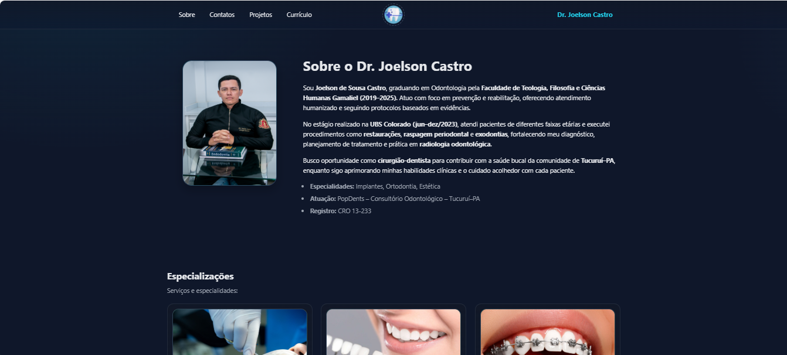

# Portifolio-Joelson Castro

Este e uma pagina de  **Portifolio do Dr Joelson Castro** uma pagina dedica a sua carreira.
O objetivo é entregar uma pagina de apresentação para o Dr Joelson Castro.

---

## 📑 Funcionalidades

- **Barra de navegação** com links principais.  
- **Header com apresentação do DR** com sua historia e foto.  
- **area apresentação de especialização** mostra sua especialização.
- **Area para apresentação de videos** com informações com videos de projetos.
- **Area com contatos** informações de contatos.

---

## 🛠️ Tecnologias Utilizadas

- **HTML5** → Estrutura da página.  
- **CSS3** → Estilização, responsividade e design moderno.  
- **Font Awesome** → Ícones visuais. 
- **JavaScript** → para fazer a transição das cores da camisa na imagem do produto.

---

## 📂 Estrutura de Pastas

├── Projeto-Portifolio-Joelson
  ├── css/
    └──styless.css     # estilização da pagina principal.
  ├── html/
     └── index.html    #pagina principal     
  ├── img/                # Imagens do projeto (logo, banner, etc.)
  ├── js/
     └── scrypt.js

🚀 Como Executar:
1 ° : git clone https://github.com/kafu14/Portifolio-Joelson-Castro.git  # baixe a pasta do projeto do githuh no seu computador.
2°  : abra a pasta do projeto Paginadeproduto".
3° : Abra o arquivo index.html localizado na pasta HTML;

Responsividade

O projeto foi desenvolvido com media queries, garantindo boa visualização em celulares, tablets e desktops.

Prévia do Projeto

📌 Autor

👤 Desenvolvido por Elionilson V. da silva
📧 Email: Elionilson.cafu14@gmail.com

🔗 LinkedIn: www.linkedin.com/in/elionilson-viana-075206326

## Licença

Projeto criado para fins educacionais e de aprendizado. Livre para uso pessoal e acadêmico.